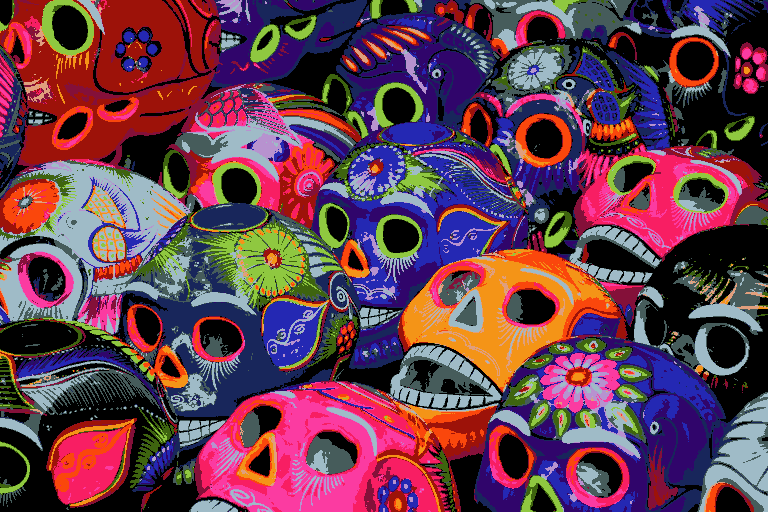
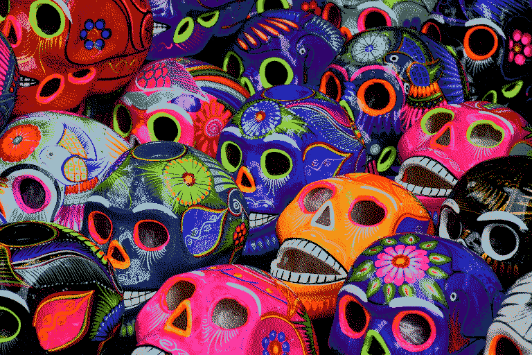
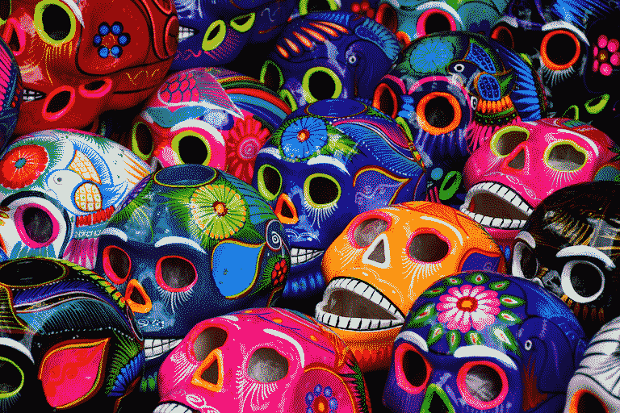
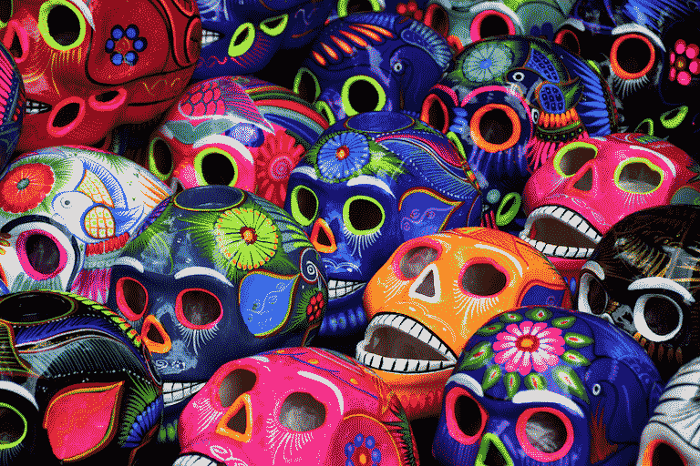
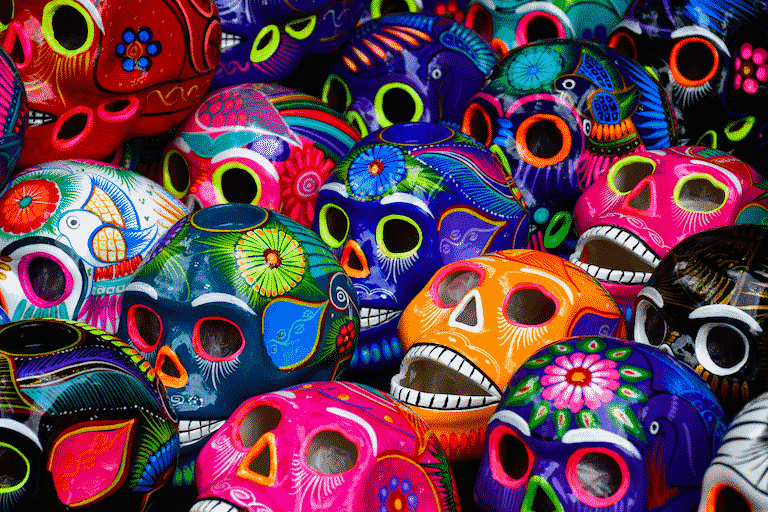
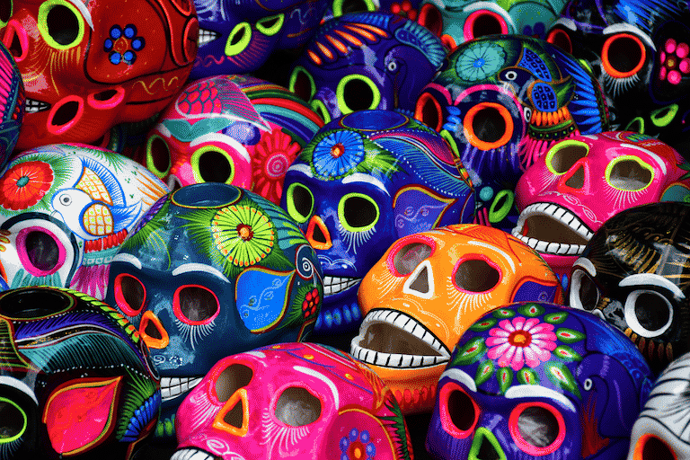

# Examples

Below are some examples of `quantette` in action.
The dissimilarity between the each image and the original is reported in the tables below
using [`dssim`](https://crates.io/crates/dssim) (lower numbers are better).
Each table starts with output from GIMP as a comparison.

Each output image was created like so:
- The GIMP output was creating using `Image > Mode > Indexed` with GIMP version `2.10.34`.
- The `Wu - sRGB` output was creating using `quantette`'s fastest quantization method.
  The default number of bins was used (`32`).
- The `K-means - Oklab` output was creating using `quantette`'s most accurate quantization method.
  A sampling factor of `0.5` and a batch size of `4096` was used.

# Original Image

# Without Dithering

## 16 Colors

| Method          | DSSIM      | Result                       |
| --------------- | ---------- | ---------------------------- |
| Gimp            | 0.06368717 |          |
| Wu - sRGB       | 0.04014392 |       |
| K-means - Oklab | 0.02632949 |  |

## 64 Colors

| Method          | DSSIM      | Result                       |
| --------------- | ---------- | ---------------------------- |
| Gimp            | 0.01730340 |          |
| Wu - sRGB       | 0.01256557 |       |
| K-means - Oklab | 0.00638550 |  |

## 256 Colors

| Method          | DSSIM      | Result                        |
| --------------- | ---------- | ----------------------------- |
| Gimp            | 0.00488789 |          |
| Wu - sRGB       | 0.00330477 |       |
| K-means - Oklab | 0.00160596 |  |

# With Dithering

## 16 Colors

| Method          | DSSIM      | Result                              |
| --------------- | ---------- | ----------------------------------- |
| Gimp            | 0. |          |
| Wu - sRGB       | 0. |       |
| K-means - Oklab | 0. |  |

## 64 Colors

| Method          | DSSIM      | Result                              |
| --------------- | ---------- | ----------------------------------- |
| Gimp            | 0. |          |
| Wu - sRGB       | 0. |       |
| K-means - Oklab | 0. |  |

## 256 Colors

| Method          | DSSIM      | Result                               |
| --------------- | ---------- | ------------------------------------ |
| Gimp            | 0. |          |
| Wu - sRGB       | 0. |       |
| K-means - Oklab | 0. |  |
